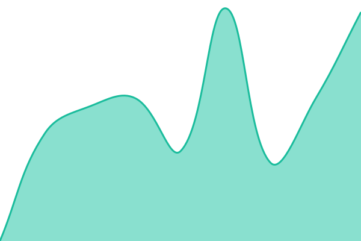
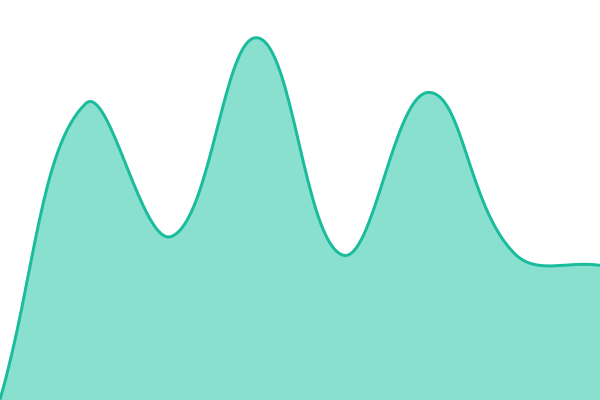
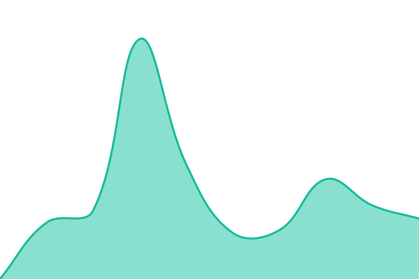
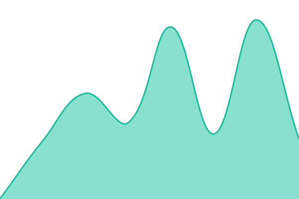
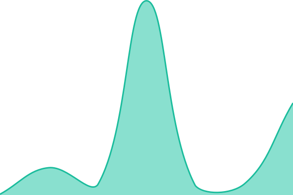
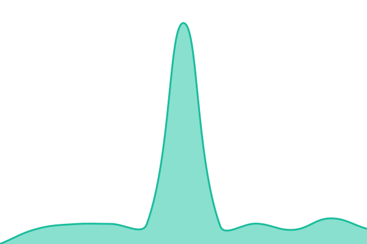

# [📈 Live Status](https://thereadonly.github.io/status): <!--live status--> **🟩 All systems operational**

This repository contains the open-source uptime monitor and status page for [kumar dinesh s](https://thereadonly.github.io/status), powered by [Upptime](https://github.com/upptime/upptime).

With [Upptime](https://upptime.js.org), you can get your own unlimited and free uptime monitor and status page, powered entirely by a GitHub repository. We use [Issues](https://github.com/thereadonly/status/issues) as incident reports, [Actions](https://github.com/thereadonly/status/actions) as uptime monitors, and [Pages](https://thereadonly.github.io/status) for the status page.

<!--start: status pages-->
<!-- This summary is generated by Upptime (https://github.com/upptime/upptime) -->
<!-- Do not edit this manually, your changes will be overwritten -->
<!-- prettier-ignore -->
| URL | Status | History | Response Time | Uptime |
| --- | ------ | ------- | ------------- | ------ |
|  [home](https://dineshkumar.xyz) | 🟩 Up | [home.yml](https://github.com/thereadonly/status/commits/HEAD/history/home.yml) | 

 863ms
     
 | 

<a href="https://status.thereadonly.com/history/home">96.36%</a>
    

|  [tRO](https://thereadonly.com) | 🟩 Up | [t-ro.yml](https://github.com/thereadonly/status/commits/HEAD/history/t-ro.yml) | 

 623ms
     
 | 

<a href="https://status.thereadonly.com/history/t-ro">96.37%</a>
    

|  [uptime](https://status.thereadonly.com) | 🟩 Up | [uptime.yml](https://github.com/thereadonly/status/commits/HEAD/history/uptime.yml) | 

 301ms
     
 | 

<a href="https://status.thereadonly.com/history/uptime">100.00%</a>
    

|  [PyIFSC@CdBrg](https://sdk.codeberg.page/getBankDetailsFromIFSC) | 🟩 Up | [py-ifsc-cd-brg.yml](https://github.com/thereadonly/status/commits/HEAD/history/py-ifsc-cd-brg.yml) | 

 975ms
     
 | 

<a href="https://status.thereadonly.com/history/py-ifsc-cd-brg">96.37%</a>
    

|  [PyIFSC@GtHb](https://thereadonly.github.io/getBankDetailsFromIFSC) | 🟩 Up | [py-ifsc-gt-hb.yml](https://github.com/thereadonly/status/commits/HEAD/history/py-ifsc-gt-hb.yml) | 

 428ms
     
 | 

<a href="https://status.thereadonly.com/history/py-ifsc-gt-hb">100.00%</a>
    

|  [PyIFSC](https://ifsc.thereadonly.com) | 🟩 Up | [py-ifsc.yml](https://github.com/thereadonly/status/commits/HEAD/history/py-ifsc.yml) | 

 41ms
     
 | 

<a href="https://status.thereadonly.com/history/py-ifsc">100.00%</a>
    

|  [FOSS4Dev](https://thereadonly.github.io/FOSS4Dev/) | 🟩 Up | [foss-4-dev.yml](https://github.com/thereadonly/status/commits/HEAD/history/foss-4-dev.yml) | 

 389ms
     
 | 

<a href="https://status.thereadonly.com/history/foss-4-dev">100.00%</a>
    

|  [Foss4Dev](foss4dev.thereadonly.com) | 🟩 Up | [foss4-dev.yml](https://github.com/thereadonly/status/commits/HEAD/history/foss4-dev.yml) | 

 86ms
     
 | 

<a href="https://status.thereadonly.com/history/foss4-dev">100.00%</a>
    

|  [www](www.thereadonly.com) | 🟩 Up | [www.yml](https://github.com/thereadonly/status/commits/HEAD/history/www.yml) | 

 811ms
     
 | 

<a href="https://status.thereadonly.com/history/www">96.37%</a>
    

<!--end: status pages-->

[**Visit our status website →**](https://thereadonly.github.io/status)

## 📄 License

- Powered by: [Upptime](https://github.com/upptime/upptime)
- Code: [MIT](./LICENSE) © [Anand Chowdhary](https://anandchowdhary.com), supported by [Pabio](https://pabio.com)
- Data in the `./history` directory: [Open Database License](https://opendatacommons.org/licenses/odbl/1-0/)
